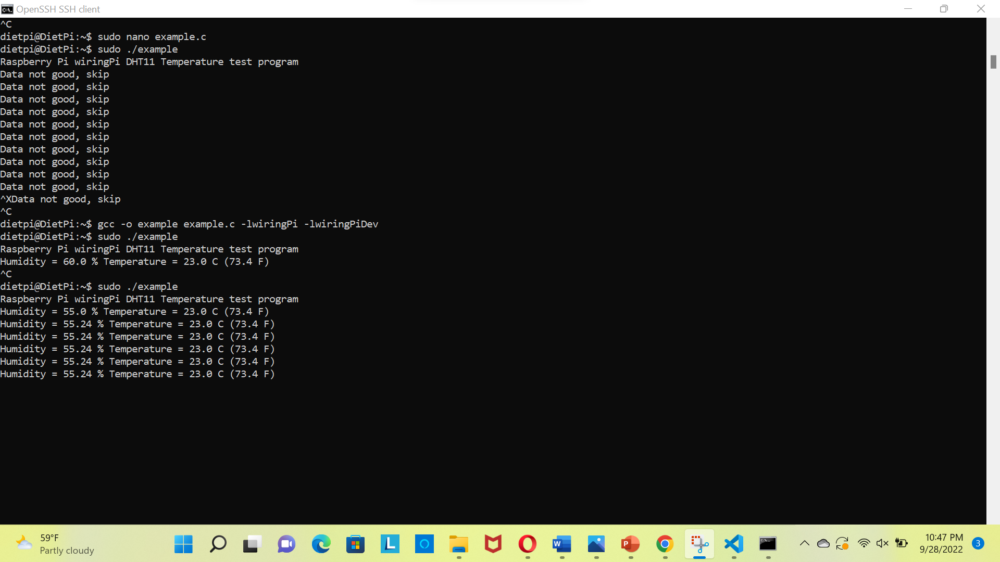

## Capturing the temperature and humidity sensor readings in raspberry pi using DTH-11 sensor
In this tutorial, we capture the temperature and humidity readings in raspberry pi using DTH-11 sensor in dietpi.

## Components Used
1.	Breadboard
2.	Jump wires
3.	Raspberry Pi
4.	DTH-11 Sensor

## Hardware
- Connect the Raspberry Pi and DTH - 11 sensors as shown below 


  
  
 ## example.c file
 ```
 #include <wiringPi.h>
#include <stdio.h>
#include <stdlib.h>
#include <stdint.h>
#define MAXTIMINGS	85
#define DHTPIN		7
int dht11_dat[5] = { 0, 0, 0, 0, 0 };
 
void read_dht11_dat()
{
	uint8_t laststate	= HIGH;
	uint8_t counter		= 0;
	uint8_t j		= 0, i;
	float	f; 
 
	dht11_dat[0] = dht11_dat[1] = dht11_dat[2] = dht11_dat[3] = dht11_dat[4] = 0;
 
	pinMode( DHTPIN, OUTPUT );
	digitalWrite( DHTPIN, LOW );
	delay( 18 );
	digitalWrite( DHTPIN, HIGH );
	delayMicroseconds( 40 );
	pinMode( DHTPIN, INPUT );
 
	for ( i = 0; i < MAXTIMINGS; i++ )
	{
		counter = 0;
		while ( digitalRead( DHTPIN ) == laststate )
		{
			counter++;
			delayMicroseconds( 1 );
			if ( counter == 255 )
			{
				break;
			}
		}
		laststate = digitalRead( DHTPIN );
 
		if ( counter == 255 )
			break;
 
		if ( (i >= 4) && (i % 2 == 0) )
		{
			dht11_dat[j / 8] <<= 1;
			if ( counter > 16 )
				dht11_dat[j / 8] |= 1;
			j++;
		}
	}
 
	if ( (j >= 40) &&
	     (dht11_dat[4] == ( (dht11_dat[0] + dht11_dat[1] + dht11_dat[2] + dht11_dat[3]) & 0xFF) ) )
	{
		f = dht11_dat[2] * 9. / 5. + 32;
		printf( "Humidity = %d.%d %% Temperature = %d.%d C (%.1f F)\n",
			dht11_dat[0], dht11_dat[1], dht11_dat[2], dht11_dat[3], f );
	}else  {
		printf( "Data not good, skip\n" );
	}
}
 
int main( void )
{
	printf( "Raspberry Pi wiringPi DHT11 Temperature test program\n" );
 
	if ( wiringPiSetup() == -1 )
		exit( 1 );
 
	while ( 1 )
	{
		read_dht11_dat();
		delay( 1000 ); 
	}
 
	return(0);
}

``` 

## Process


- Log on to the dietpi and obtain WiringPi by typing in the command below and then search for WiringPi
   
   `sudo dietpi-software`
 -  Later go to WiringPi (type the following commands)


     `cd WiringPi`

    `git pull origin`
- Perform the build operation in the WiringPi by typing in the following command

    `./build`
- Create a .c file by typing in the following command (here "example.c")

  `sudo nano example.c`
 - Then compile and run the code by using the following commands
 
   `gcc -o example example.c -lwiringPi -lwiringPiDev`
   
    `sudo ./example`
    
   - Then the following output (of temperature and humidity values) is observed
    
   


    


