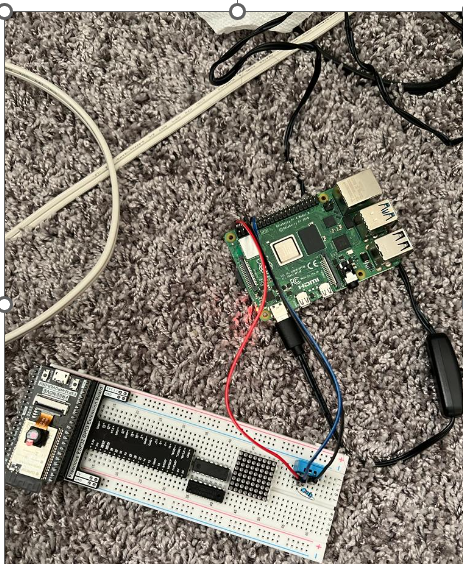

## Capturing the temperature and humidity sensor readings in raspberry pi using DTH-11 sensor
In this tutorial, we capture the temperature and humidity readings in raspberry pi using DTH-11 sensor in dietpi.

## Components Used
1.	Breadboard
2.	Jump wires
3.	Raspberry Pi
4.	DTH-11 Sensor

## Hardware
- Connect the Raspberry Pi and DTH - 11 sensors as shown below 

  

 

## Process

- Log on to the dietpi and obtain WiringPi by typing in the command below and then search for WiringPi
   
   `sudo dietpi-software`
 -  Later go to WiringPi (type the following commands)

     `cd WiringPi`

    `git pull origin`
- Perform the build operation in the WiringPi by typing in the following command

    `./build`
- Create a .c file by typing in the following command (here "example.c")

  `sudo nano example.c`
 - Then compile and run the code by using the following commands
 
   `gcc -o example example.c -lwiringPi -lwiringPiDev`
   
    `sudo ./example`
    
   - Then the following output (of temperature and humidity values) is observed
    
   

    

