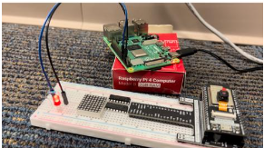

## Breathing Led Experiment

In this experiment we will make a light LED "breathing" using C. The light intensity will start from zero and gradually will increase up to maximum and then will decrease back to zero.

## Components Used

1. LED
2. Raspberry Pi
3. Jumping Wires
4. Breadboard

# breathe.c file

```
#include <wiringPi.h>
#include <stdio.h>

#define LedPin    1

int main(void)
{
	int i;

	if(wiringPiSetup() < 0) { //when initialize wiringPi failed, print message to screen
		printf("setup wiringPi failed !\n");
		return -1;
	}

	pinMode(LedPin, PWM_OUTPUT); //pwm output mode

	while(1) {
		for(i=0;i<1024;i++) {
			pwmWrite(LedPin, i);
			delay(1);
		}
		delay(1000);
		for(i=1023;i>=0;i--) {
			pwmWrite(LedPin, i);
			delay(1);
		}
	}

	return 0;
}

```

## Hardware

  The connections are made as shown below
  
  
  
  
 ## Procedure
 
 -  First log on to the pi by typing the command (where IPADDR is the IP address of the pi) and then by typing in the password
    
    `ssh dietpi@IPADDR` 
    
  -  Create the .c file by typing in the command (here the file is breathe.c)
  
    `sudo nano breathe.c`
    
  -  Then compile and run the file (breathe.c) by using the commands below
  
      `gcc breathe.c -o breathe -lwiringPi`
   
      `sudo ./breathe`
      
      The below is the video showing the breathing LED experiment
      
      [](https://youtu.be/8xEZKoIw06Y)
