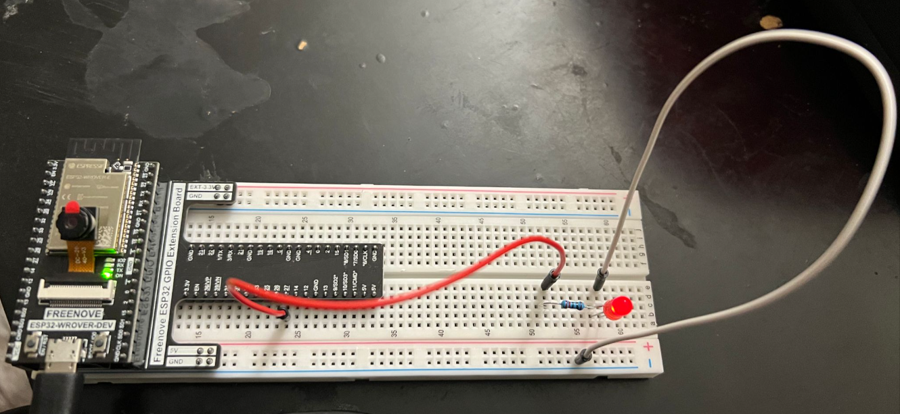
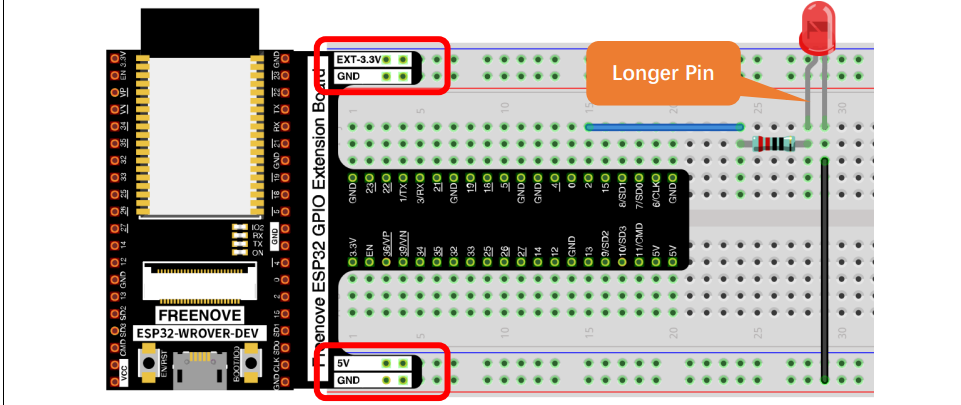
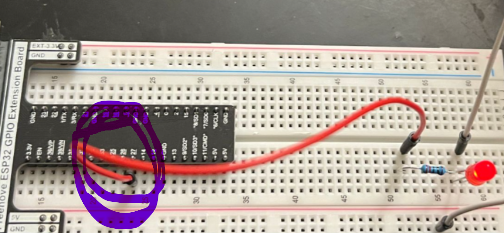
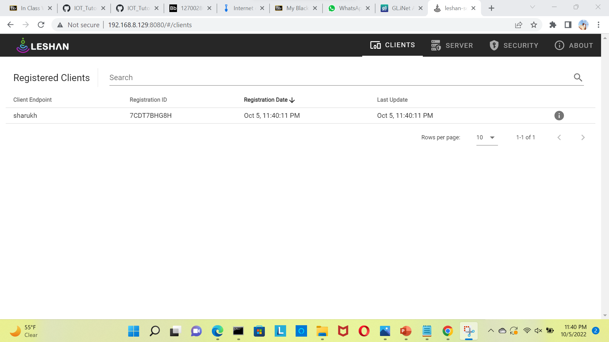
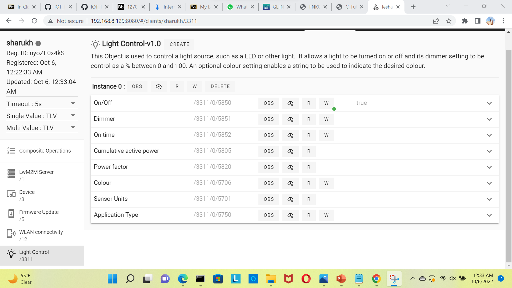

## Light Control Experiment
In this experiment we will control LED light state.

## Components Used
1. LED 
2. Breadboard
3. Jumper Wires
4. Resistor (220ohmx1)
5. ESP32 Wrover
6. GPIO Extension Board

## Hardware
All the components are connected as shown in the below figure.

## Process
- Open the menu config by typing in the following commands

    `cd ~/projects/Anjay-esp32-client`

   `idf.py menuconfig`

- Next navigate to component config 

- Select anjay-esp32-client.

- Select light control and is enabled.

- Next  navigate to light control options, enable the red light and entered the pin number.( I have used pin 27)

- Later build the code

  `cd ~/projects/Anjay-esp32-client`
 
   ` idf.py build`
 
 - Finally flash the code by typing in the following commands.
 
     `cd ~/projects/Anjay-esp32-client`
 
    `sudo chmod 666 /dev/ttyUSB0`

     `idf.py -p 0 flash`
     
     - In the leshan server select the anjay client from the list

     

- Later open the Light Control menu
 
 

- Here in this page, the status of the LED is displayed. You can go to write ‘w’ in On/Off and give Boolean values for the LED to turn it on or off. You can also set the dimmer by going to ‘w’ and give integer values ranging from 0 to 100.

- The below is the video

https://user-images.githubusercontent.com/112524594/194425745-81b10b96-6b74-474f-9ca0-40d65e952b99.mp4

