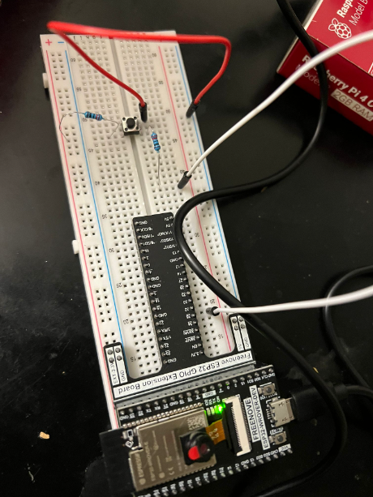
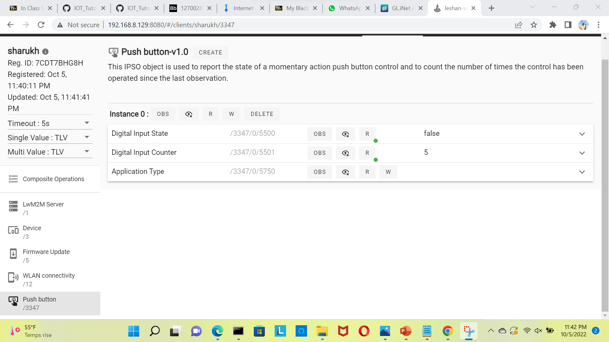

## Push Button Experiment
In this experiment we will observe the reading of number of times the pushed button is clicked.

## Components Used
1. Push Button
2. Breadboard
3. Jumper Wires
4. Resistors (220ohmx2)
5. ESP32 Wrover
6. GPIO Extension Board

## Hardware
All the components are connected as shown in the below figure.

 

## Process
 - Log on to your dietpi by using the comamnd and then by typing in your password

   ` ssh dietpi@(IPADDR_OF_PI)`
 
 - Start the leshan server
 
   `cd ~/projects/leshan`
 
 
   `java -jar leshan-server-demo/target/leshan-server-demo-*-SNAPSHOT-jar-with-dependencies.jar &`
 
-  Move to the anjay-esp32-client directory that was clone earlier
 
   `cd ~/projects/Anjay-esp32-client`

- Setup the local enironment for using the esp tools

   `cd ~/projects/Anjay-esp32-client`

  `. $HOME/esp/esp-idf/export.sh`

   `idf.py set-target esp32 `

- setup the device requirements

    `cd ~/projects/Anjay-esp32-client`

    `idf.py menuconfig`

- navigate to "Component->" and select config/anjay-esp32-client:
- Setup your config to be: (anjay-esp32-client) Endpoint name (coap://{LESHAN_SERVER_IP}:5683) Server URI Choose socket (UDP) ---> Choose security mode (Non-secure connection) --->

- Navigate to "Board - > "

- Navigate to "Client options ->"

- Change Server URI from coaps://try-anjay.avsystem.com:5684 to coaps://YOUR_LESHAN_SERVER_IP_ADDR:5683

- Navigate to "WiFi ->" To enter your IOT ROUTER WIFI SSID and key to allow the esp32 acccess to your router and PI.

- Build the code for the device using

    `cd ~/projects/Anjay-esp32-client`
 
   `idf.py build`
 

- find port number by using

   `ls -l /dev/ttyUSB*`

- Later perform the flash operation by typing in the commands
   `cd ~/projects/Anjay-esp32-client`

   `sudo chmod 666 /dev/ttyUSB0`

   `idf.py -p 0 flash`

- In the leshan server select the anjay client from the list

- Later open the Push Button menu
 

 
