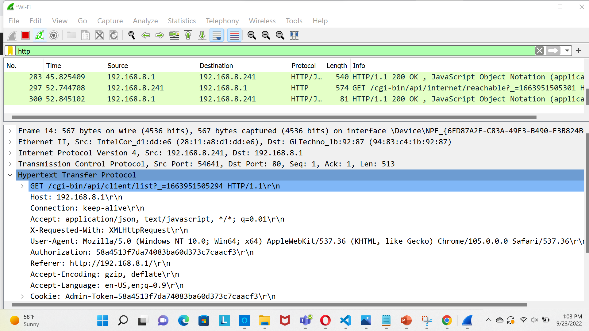

I have opened the wireshark and then opened the Wi-Fi option. We can see the various protocols. Then I have searched for http and the observed the following…

The next thing I did was playing with the interface. I have connected to the leshan client and then opened it. I have created few objects (by using create command in cmd) and then observed the changes in the interface. The below are the screenshots..
![image](
