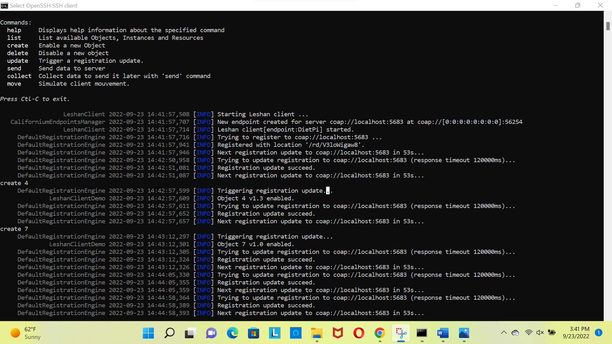
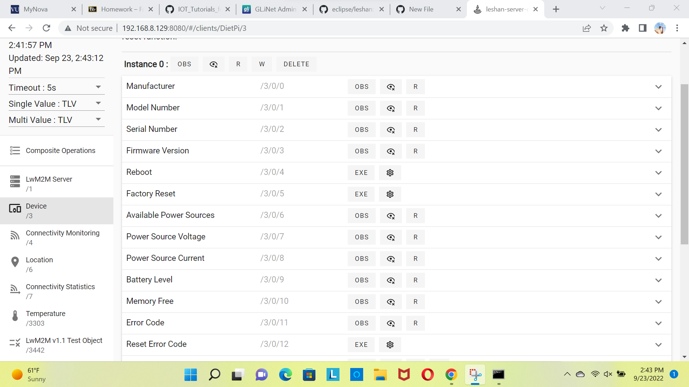

## Experiments

## What is Wireshark?

Wireshark is a free and open-source packet analyzer. It is used for network troubleshooting, analysis, software and communications protocol development, and education. Originally named Ethereal, the project was renamed Wireshark in May 2006 due to trademark issues.

## Uses of Wireshark

It is an open source software so you can use it on your end system as well. The way it works is that it monitors the network interface cards, and then captures traffic passing through. There are multiple things you can do with the data it captures. I would try to name the few below:

-  Capturing and analyzing packets on NICs
-  ability to negotiate multiple protocols on each OSI layer
-  capturing NIC for many layer 2 protocols like PPP, Ethernet, HDLC etc as well as ARP requests and routing protocol Hello messages etc
-  ability to capture different media traffic, like USB , VOIP calls , application layer protocol streams
-  ability to see the data (the best one) , for example if someone telnets on a router, and you are sniffing with your Wireshark in the network, it will catch the -   -  stream of data. And it can clearly show the actual password written by the user. Based on its ability to read TCP stream, SSH is more preferable.

Wireshark to Analyze Protocols
-------------------------------

I have opened the wireshark and then opened the Wi-Fi option. We can see the various protocols. Then I have searched for http and the observed the following…

Interface Testing
-------------------------

The next thing I did was playing with the interface. The following are the steps...
- Connect to the leshan client and then open it.
- Created few objects (by using create command in cmd) and then observe the changes in the interface. 

The below are the screenshots..

