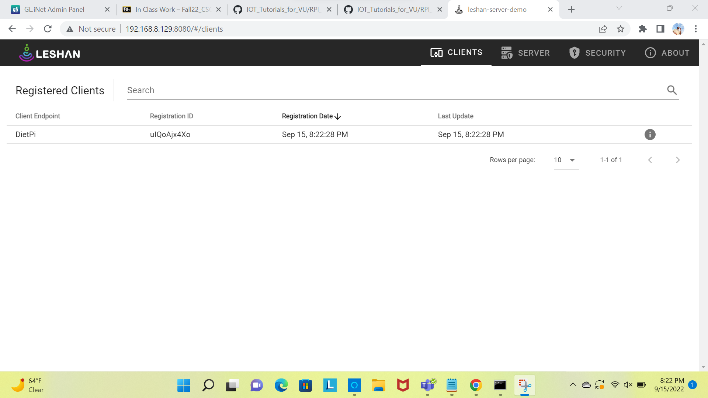

## Leshan Installation

- Installed Leshan by following professor’s instructions.
- Log on to the Raspberry Pi by using the command ``` ssh dietpi@IPADDR ``` (IPADDR is the IP address of Diet Pi) and then by typing in the password.
- Later install git by typing in the command “sudo dietpi-software” . 
- Then Searched for the software git and install it. 
- Check the version of git by using the  ```command “git –version” ```.
- Install java jdk by using the command ``` sudo dietpi-software ``` and search for jdk. 
- Later check if it was installed by using the command ```java - -version```
- Create a directory called “download“ in the dietpi. 
- Change to the 'download' directory by using the cd command and then downloaded the latest version of maven using wget.
- Setup environment variables to add to maven paths and then confirm the maven installation
- Later  install leshan git and then build it. 
- Start the leshan server and then connect to leshan demo by using the command UI:  ``` http://RPI_IPADDR:8080 ``` (where RPI_IPADDR is the pi’s IP address). 
- Use the command ``` java -jar leshan-client-demo/target/leshan-client-demo-*-SNAPSHOT-jar-with-dependencies.jar ``` in the command prompt.
-  You can see your dietpi in the leshan page.
-
The below is the picture..dietpi's registration ID and registartion date are visible in the leshan page.



