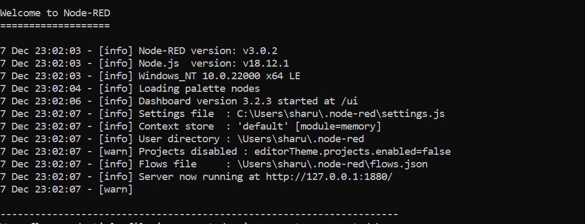
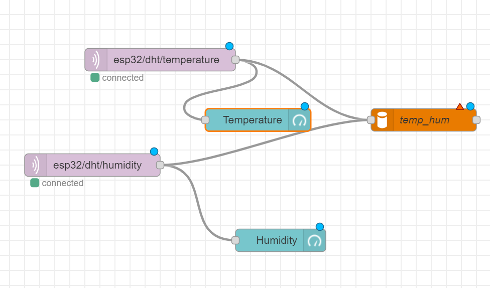
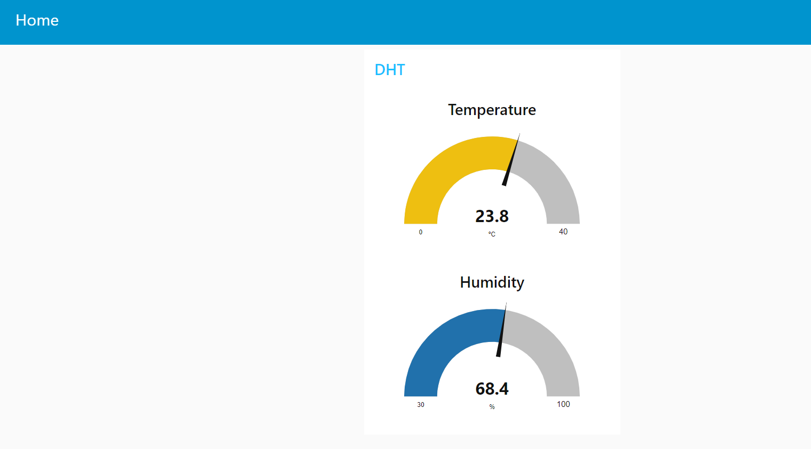

## What is Node Red?

Node-Red is a flow based programming tool. Node-Red was mainly intended to create flows for IoT (Internet Of Things) Devices. 

## Node Red Installation

 Go to '''https://nodered.org/docs/getting-started/windows''' and download the Node Red
 
 Once installed, open a command prompt and run the following command to ensure Node.js and npm are installed correctly.
 
 if using a powershell:  node --version; npm --version
 
 if using cmd : node --version && npm --version
 
 Later, execute the following command in the command prompt
 
 npm install -g --unsafe-perm node-red
 
 Once installed, type "node-red" in the cmd to run the Node-Red
 
 

## What is Node Red Dashboard?

The node red dashboard is an add-on module that lets you create live dashboards. It is an optional module and it is not installed by default.

## Installing Node Red Dashboard

The below are the steps for installing the node red dashboard
- Go to Manage Palette -> User Settings -> Install in Node - Red 
- Search for “Node-Red-Dashboard”.
- Click install.

## Node Red Flow for Sensing Temperature and Humidity Proj.

The below is the node-red flow the " Sensing Temperature and Humidity Project"
 
 
 - esp32/dht/temperature is the mqtt topic corresponding to the temperature
 - esp32/dht/humidity is the mqtt topic corresponding to the humidity
 - The blue colored nodes "Temperature" and "Humidity" refer to the UI representation in the node red dashboard
 - temp_hum is the database.
 ## Node Red Dashboard - Sensing Temperature and Humidity
 
  
  
  In the above figure we can see the  real time values of temperature and humidity.

 
